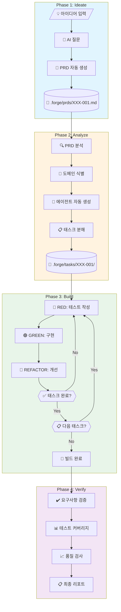
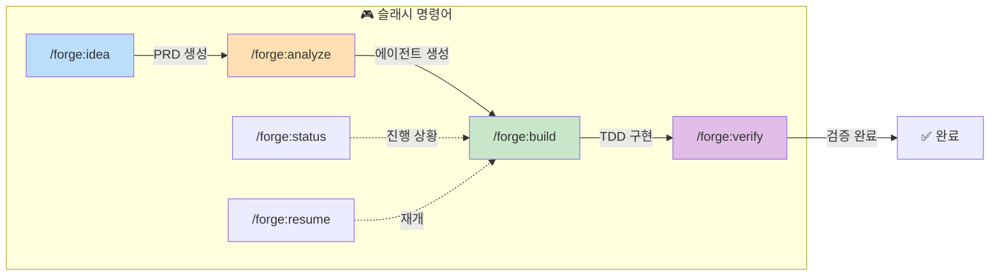
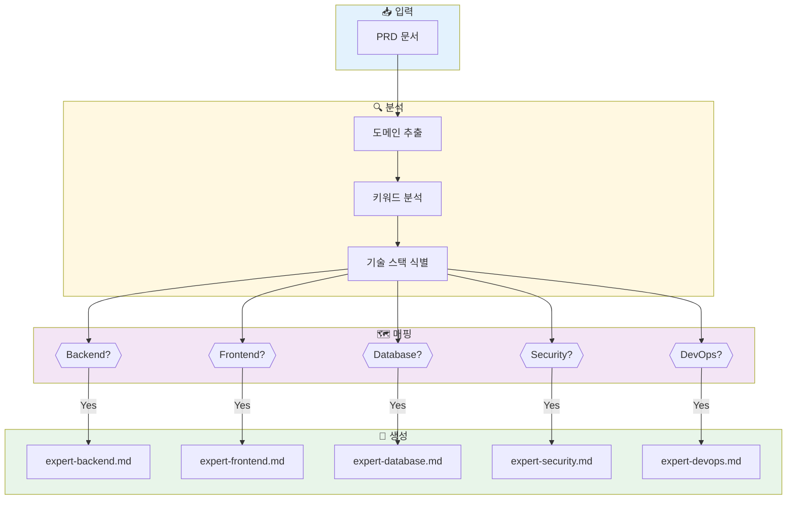
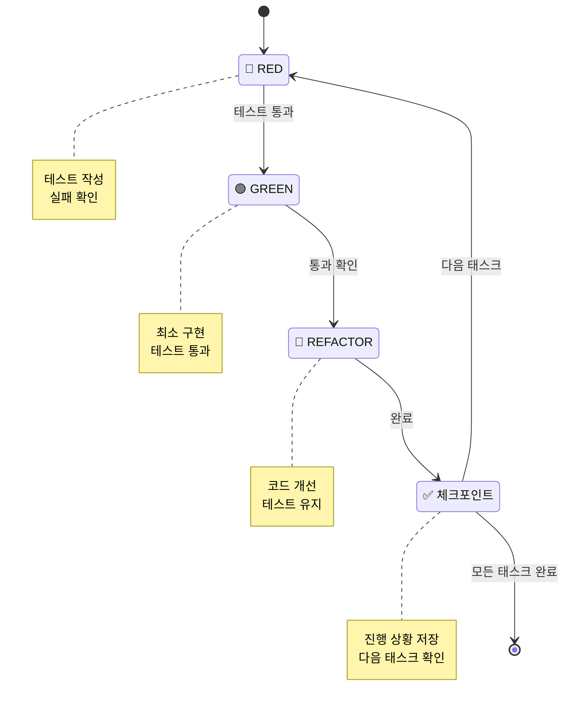

# IdeaForge 워크플로우 다이어그램

## 전체 흐름



## 명령어 흐름



## 에이전트 자동 생성 로직



## TDD 사이클 상세



## 파일 구조

```
project/
├── .claude/
│   ├── agents/
│   │   ├── forge-orchestrator.md    # 메인 오케스트레이터
│   │   ├── forge-prd-writer.md      # PRD 작성 전문가
│   │   ├── forge-analyzer.md        # 요구사항 분석가
│   │   └── forge-tdd-runner.md      # TDD 실행자
│   │
│   ├── commands/forge/
│   │   ├── idea.md                  # /forge:idea
│   │   ├── analyze.md               # /forge:analyze
│   │   ├── build.md                 # /forge:build
│   │   ├── verify.md                # /forge:verify
│   │   ├── status.md                # /forge:status
│   │   ├── list.md                  # /forge:list
│   │   └── resume.md                # /forge:resume
│   │
│   ├── skills/forge-patterns/
│   │   └── SKILL.md                 # 코딩 패턴
│   │
│   └── settings.json                # 권한 설정
│
├── .forge/
│   ├── config.json                  # IdeaForge 설정
│   │
│   ├── prds/                        # PRD 문서들
│   │   ├── AUTH-001.md
│   │   ├── CHAT-002.md
│   │   └── ...
│   │
│   ├── tasks/                       # 태스크 분해
│   │   ├── AUTH-001/
│   │   │   ├── tasks.json           # 태스크 목록
│   │   │   └── breakdown.md         # 분해 내용
│   │   └── ...
│   │
│   ├── agents/                      # 동적 생성 에이전트
│   │   ├── AUTH-001/
│   │   │   ├── expert-backend.md
│   │   │   └── expert-security.md
│   │   └── ...
│   │
│   ├── progress/                    # 진행 상황
│   │   ├── AUTH-001/
│   │   │   ├── checkpoint.json      # 체크포인트
│   │   │   └── history.json         # 작업 이력
│   │   └── ...
│   │
│   └── reports/                     # 최종 리포트
│       ├── AUTH-001-final.md
│       └── ...
│
├── .mcp.json                        # MCP 서버 설정
├── CLAUDE.md                        # 프로젝트 지시문
└── README.md
```

## 진행 상황 추적 UI

```
┌─────────────────────────────────────────────────────────────────┐
│  🔨 IdeaForge v0.1.0                              📊 Dashboard   │
├─────────────────────────────────────────────────────────────────┤
│                                                                 │
│  📋 Current PRD: AUTH-001 (사용자 인증 시스템)                    │
│  ────────────────────────────────────────────────────────────── │
│                                                                 │
│  Phase: [■] Idea  [■] Analyze  [▶] Build  [ ] Verify            │
│                                                                 │
│  ┌─ Requirements ─────────────────────────────────────────────┐ │
│  │ ✅ FR-001: 이메일/비밀번호 로그인                            │ │
│  │ 🔄 FR-002: OAuth 소셜 로그인 (진행 중)                       │ │
│  │ ⬚ FR-003: 비밀번호 재설정                                   │ │
│  │ ⬚ NFR-001: 응답시간 < 200ms                                │ │
│  │ ⬚ NFR-002: 보안 표준 준수                                   │ │
│  └─────────────────────────────────────────────────────────────┘ │
│                                                                 │
│  ┌─ TDD Cycle ────────────────────────────────────────────────┐ │
│  │                                                             │ │
│  │   FR-002 OAuth 로그인                                       │ │
│  │   [🔴 RED] ──▶ [🟢 GREEN] ──▶ [🔵 REFACTOR]                │ │
│  │      ✓          진행 중            대기                      │ │
│  │                                                             │ │
│  └─────────────────────────────────────────────────────────────┘ │
│                                                                 │
│  ┌─ Active Agents ────────────────────────────────────────────┐ │
│  │ 🤖 expert-backend     │ OAuth 토큰 검증 로직 구현 중         │ │
│  │ 💤 expert-security    │ 대기 중                             │ │
│  └─────────────────────────────────────────────────────────────┘ │
│                                                                 │
│  Progress: ████████████░░░░░░░░░░░░░░░░░░░ 40%  (2/5 tasks)    │
│                                                                 │
│  ⏱️ Elapsed: 1h 23m  │  📈 Est. Remaining: 2h 10m               │
│                                                                 │
├─────────────────────────────────────────────────────────────────┤
│  [/forge:resume] [/forge:status] [/forge:pause] [/forge:verify] │
└─────────────────────────────────────────────────────────────────┘
```
