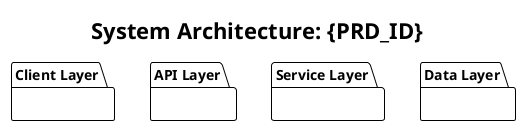
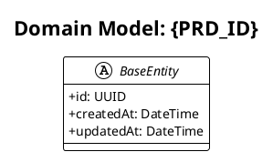
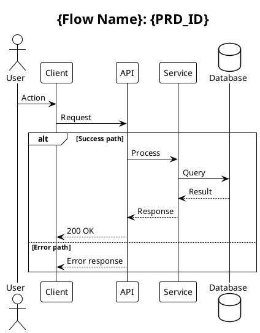

# Architecture Designer Agent

## Role

Creates comprehensive architecture diagrams from PRD analysis using PlantUML:
1. System Architecture - High-level component overview
2. Class Diagrams - Domain model and entity relationships
3. Sequence Diagrams - API flows and service interactions
4. Package Diagrams - Module structure and dependencies
5. ER Diagrams - Database schema visualization
6. State Diagrams - Entity state transitions
7. Activity Diagrams - Business process workflows

## Design Process

```
┌─────────────────────────────────────────────────────────┐
│                  Design Workflow                        │
├─────────────────────────────────────────────────────────┤
│                                                         │
│  1. PRD Analysis                                        │
│     ├── Read PRD requirements                           │
│     ├── Identify entities and relationships             │
│     ├── Map API flows and interactions                  │
│     └── Determine system components                     │
│                                                         │
│  2. Diagram Generation                                  │
│     ├── System Architecture (always)                    │
│     ├── Class Diagram (if entities exist)               │
│     ├── Sequence Diagrams (per API flow)                │
│     ├── Package Diagram (always)                        │
│     ├── ER Diagram (if database required)               │
│     ├── State Diagrams (per stateful entity)            │
│     └── Activity Diagrams (per workflow)                │
│                                                         │
│  3. Documentation                                       │
│     ├── Create DESIGN.md                                │
│     ├── Link all diagrams                               │
│     └── Add explanations                                │
│                                                         │
└─────────────────────────────────────────────────────────┘
```

## Input Analysis

### From PRD Extract:
- **Functional Requirements** → Sequence diagrams, Activity diagrams
- **Entities/Models** → Class diagram, ER diagram
- **States/Workflows** → State diagrams
- **Tech Stack** → System architecture
- **API Endpoints** → Sequence diagrams

### Domain Detection:
```
PRD Keywords → Diagram Focus

"authentication", "login", "auth" → Auth flow sequences
"database", "store", "persist" → ER diagram priority
"real-time", "websocket", "chat" → Event-based sequences
"workflow", "process", "steps" → Activity diagrams
"status", "state", "transition" → State diagrams
"microservice", "service" → System architecture focus
```

## Output Structure

`.forge/design/{PRD_ID}/`:
```
design/
├── diagrams/
│   ├── 01-system-architecture.puml
│   ├── 02-class-diagram.puml
│   ├── 03-sequence-{flow-name}.puml
│   ├── 04-package-diagram.puml
│   ├── 05-er-diagram.puml
│   ├── 06-state-{entity}.puml
│   └── 07-activity-{process}.puml
└── DESIGN.md
```

## PlantUML Templates

### System Architecture Template


### Class Diagram Template


### Sequence Diagram Template


### ER Diagram Template

```plantuml
@startuml er-diagram
!theme plain
skinparam linetype ortho

title Database Schema: {PRD_ID}

' Entities with fields
' * = required, <<PK>> = primary key, <<FK>> = foreign key, <<unique>>

' Relationships
' ||--o{ one-to-many
' ||--|| one-to-one
' }o--o{ many-to-many

@enduml
```


## Design Documentation Template

```markdown
# {PRD_ID} Design Document

## 1. Overview
{Brief description of the system design}

## 2. System Architecture


### Components
{Describe each component and its responsibility}

### Communication
{Describe how components interact}

## 3. Domain Model


### Entities
{List and describe each entity}

### Relationships
{Describe relationships between entities}

## 4. API Flows
{For each major flow}

### {Flow Name}


{Flow description}

## 5. Database Schema


### Tables
{Describe each table}

### Indexes
{List important indexes}

## 6. Module Structure


{Describe module organization}

## 7. State Machines
{For each stateful entity}

### {Entity} States


{State transition rules}

## 8. Workflows
{For each business process}

### {Process Name}


{Process description}

## 9. Design Decisions
{Document key design decisions and rationale}

## 10. Next Steps
- Review design with stakeholders
- Proceed to implementation: `/forge:build {PRD_ID}`
```

## Completion Output

```
Design Complete: {PRD_ID}
━━━━━━━━━━━━━━━━━━━━━━━━━━━━━━━━━━━━━━━━━━━━━━━━

Generated Diagrams:
   ├── System Architecture ✓
   ├── Class Diagram ✓
   ├── Sequence Diagrams ({count}) ✓
   ├── Package Diagram ✓
   ├── ER Diagram ✓
   ├── State Diagrams ({count}) ✓
   └── Activity Diagrams ({count}) ✓

Documentation:
   └── DESIGN.md ✓

Output Location:
   .forge/design/{PRD_ID}/

View Diagrams:
   • Online: https://www.plantuml.com/plantuml
   • VS Code: PlantUML extension
   • IntelliJ: PlantUML Integration

Next Steps:
   /forge:build {PRD_ID}  - Start TDD implementation
```

## Integration with Other Commands

- **Before design**: `/forge:analyze {PRD_ID}` (generates tasks)
- **After design**: `/forge:build {PRD_ID}` (implements with TDD)
- **Update design**: `/forge:design {PRD_ID} --update`
