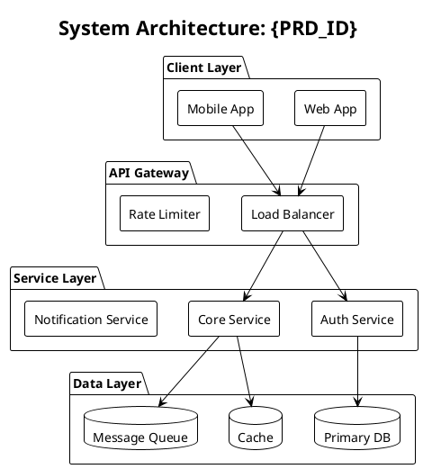
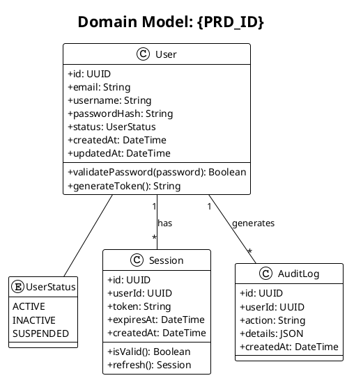
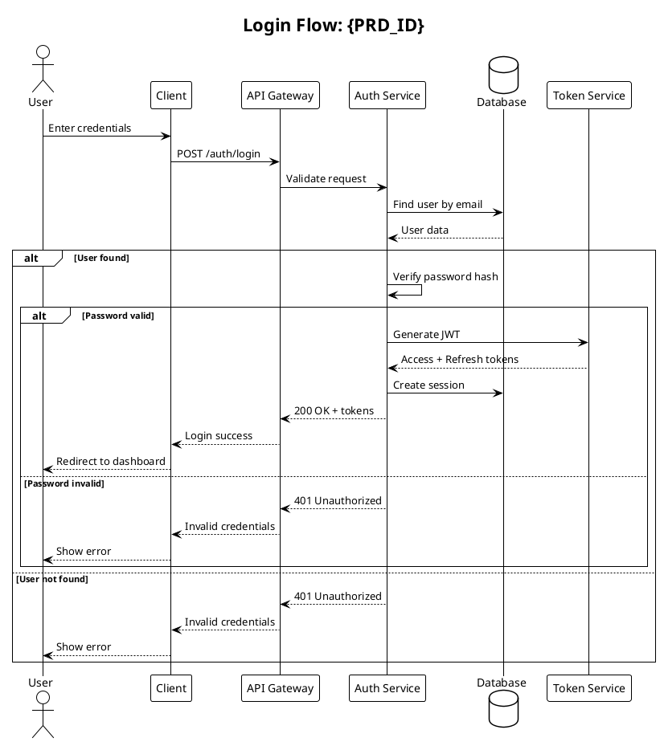
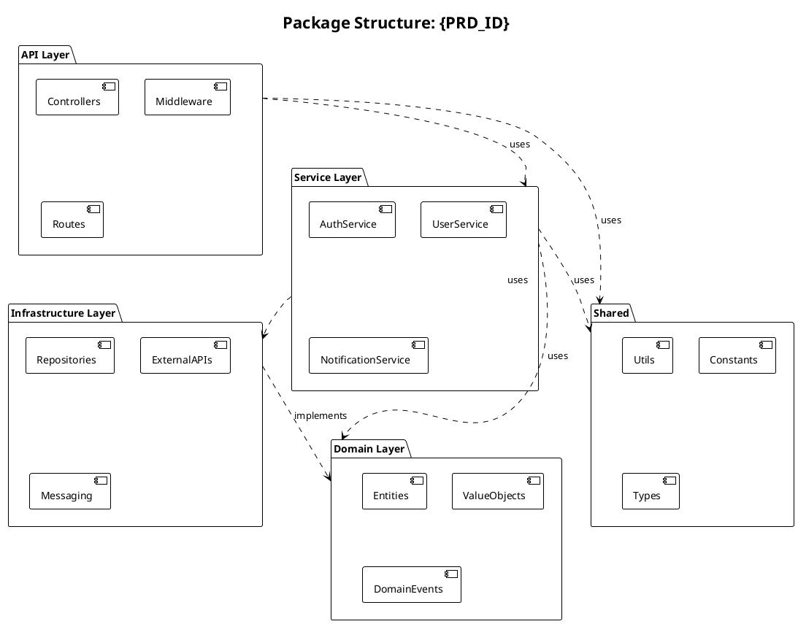
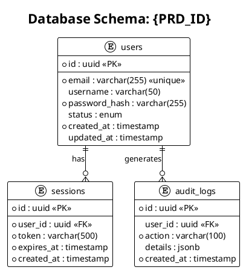
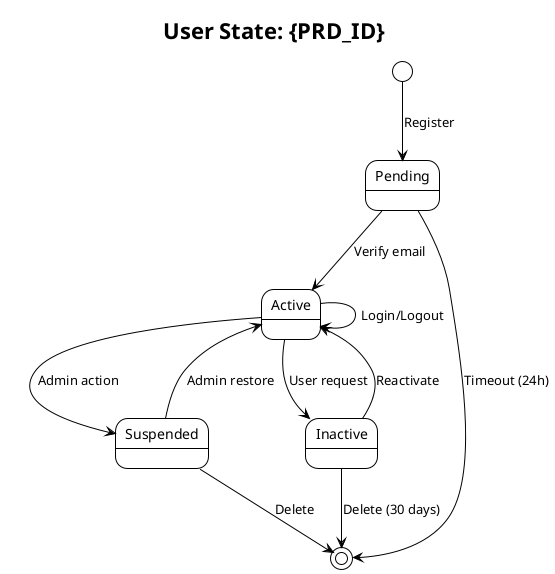
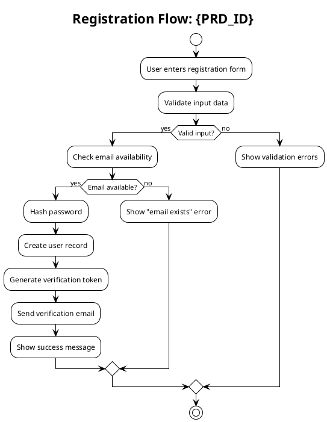

# /forge:design - Architecture Design & Diagrams

## Usage

```
/forge:design AUTH-001
/forge:design AUTH-001 --type class
/forge:design AUTH-001 --type sequence --flow login
```

## Input

`$ARGUMENTS` - PRD ID (optionally specify diagram type and scope)

## Language Configuration

Read from `.forge/config.json`:
- Use `language.conversation` for design explanations
- Use `language.output_documents` for diagram documentation

## Workflow

### 1. Design Preparation

```
IdeaForge Design: {PRD_ID}
━━━━━━━━━━━━━━━━━━━━━━━━━━━━━━━━━━━━━━━━━━━━━━━━
```

1. Load PRD: `.forge/prds/{PRD_ID}.md`
2. Load tasks: `.forge/tasks/{PRD_ID}/tasks.json`
3. Analyze requirements for design elements

### 2. Diagram Types

#### System Architecture Diagram
High-level system overview showing all components and their relationships.



#### Class Diagram
Entity and model structure with relationships.



#### Sequence Diagram
API flow and service communication.



#### Package/Component Diagram
Module structure and dependencies.



#### ER Diagram (Entity Relationship)
Database schema visualization.



#### State Diagram
State transitions for entities.



#### Activity Diagram
Workflow and business process.



### 3. Design Output Structure

`.forge/design/{PRD_ID}/`:
```
design/
├── diagrams/
│   ├── system-architecture.puml
│   ├── class-diagram.puml
│   ├── sequence-login.puml
│   ├── sequence-register.puml
│   ├── package-diagram.puml
│   ├── er-diagram.puml
│   ├── state-user.puml
│   └── activity-register.puml
├── images/                      # Generated PNG/SVG (optional)
│   ├── system-architecture.png
│   └── ...
└── DESIGN.md                    # Design documentation
```

### 4. Design Documentation

`.forge/design/{PRD_ID}/DESIGN.md`:

```markdown
# {PRD_ID} Design Document

## Overview
{Brief description of the design}

## System Architecture


{Architecture explanation}

## Domain Model


### Entities
- **User**: Core user entity with authentication
- **Session**: User session management
- **AuditLog**: Activity tracking

## API Flows

### Login Flow


{Flow explanation}

### Registration Flow


{Flow explanation}

## Database Schema


{Schema explanation}

## Module Structure


{Module explanation}
```

### 5. Completion Message

```
Design Complete: {PRD_ID}
━━━━━━━━━━━━━━━━━━━━━━━━━━━━━━━━━━━━━━━━━━━━━━━━

Generated Diagrams:
   ├── System Architecture ✓
   ├── Class Diagram ✓
   ├── Sequence Diagrams (3) ✓
   ├── Package Diagram ✓
   ├── ER Diagram ✓
   ├── State Diagrams (2) ✓
   └── Activity Diagrams (2) ✓

Output:
   .forge/design/{PRD_ID}/

View Options:
   • PlantUML Server: https://www.plantuml.com/plantuml
   • VS Code Extension: PlantUML
   • IntelliJ Plugin: PlantUML Integration

Next Steps:
   /forge:build {PRD_ID}  - Start implementation
   /forge:design {PRD_ID} --type sequence --flow {name}  - Add more diagrams
```

## Options

- `--type {type}`: Generate specific diagram type only
  - `system`: System architecture
  - `class`: Class/domain model
  - `sequence`: Sequence diagram
  - `package`: Package/component
  - `er`: Entity relationship
  - `state`: State diagram
  - `activity`: Activity diagram
- `--flow {name}`: For sequence/activity, specify the flow name
- `--format {format}`: Output format (puml, png, svg)
- `--update`: Update existing diagrams based on changes
