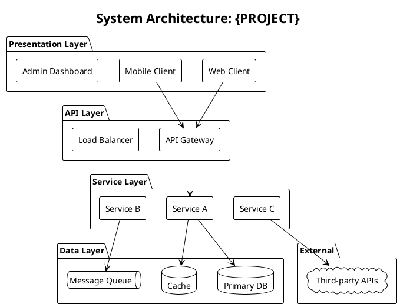
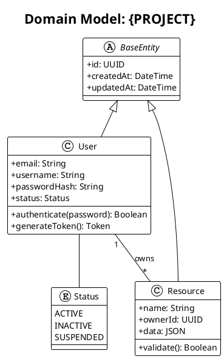
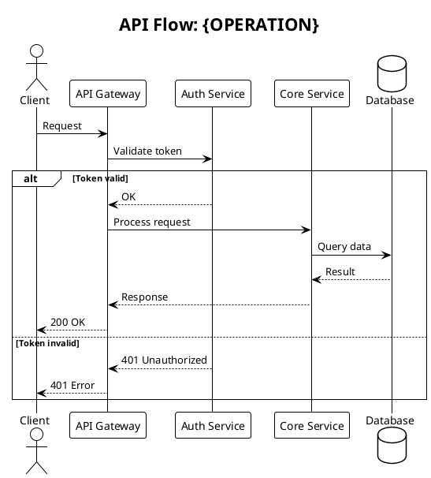
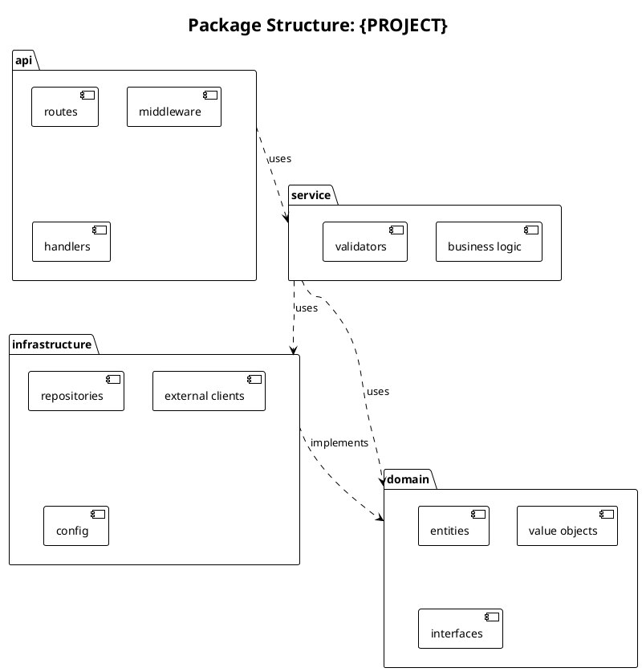
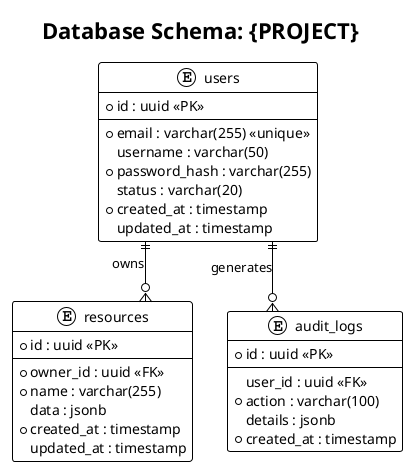
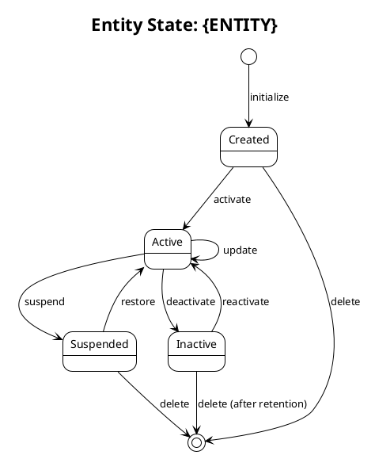
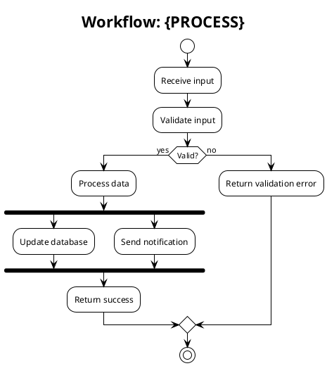

# Architecture Design (PlantUML)

> Text-based architecture visualization with PlantUML.
> Preview: https://www.plantuml.com/plantuml

---

## Diagram Types Overview

| Type | Purpose | Use When |
|------|---------|----------|
| System Architecture | High-level component overview | Project kickoff, stakeholder communication |
| Class Diagram | Entity/model relationships | Domain modeling, database design |
| Sequence Diagram | API flow, service interaction | API design, integration planning |
| Package Diagram | Module structure, dependencies | Code organization, layering |
| ER Diagram | Database schema | Data modeling |
| State Diagram | Entity state transitions | Workflow design |
| Activity Diagram | Business process flow | User journey, workflow |

---

## System Architecture Diagram



---

## Class Diagram (Domain Model)



---

## Sequence Diagram (API Flow)



---

## Package/Component Diagram



---

## ER Diagram (Database Schema)



---

## State Diagram



---

## Activity Diagram (Workflow)



---

## Design Output Structure

```
.forge/design/{PRD_ID}/
├── diagrams/
│   ├── system-architecture.puml
│   ├── class-diagram.puml
│   ├── sequence-{flow}.puml
│   ├── package-diagram.puml
│   ├── er-diagram.puml
│   ├── state-{entity}.puml
│   └── activity-{process}.puml
├── images/                      # Generated images (optional)
└── DESIGN.md                    # Design documentation
```

---

## PlantUML Best Practices

1. **Use themes**: `!theme plain` for clean output
2. **Title every diagram**: `title {Diagram Name}`
3. **Group related elements**: Use `package`, `rectangle`, `folder`
4. **Use stereotypes**: `<<interface>>`, `<<abstract>>`, `<<PK>>`, `<<FK>>`
5. **Keep diagrams focused**: One concept per diagram
6. **Use consistent naming**: Match code naming conventions
7. **Add notes when needed**: `note right of X : explanation`

---

## Rendering Options

| Tool | Description |
|------|-------------|
| PlantUML Server | https://www.plantuml.com/plantuml |
| VS Code Extension | PlantUML extension |
| IntelliJ Plugin | PlantUML Integration |
| CLI | `java -jar plantuml.jar diagram.puml` |
| GitHub Action | `plantuml/plantuml-action` |
